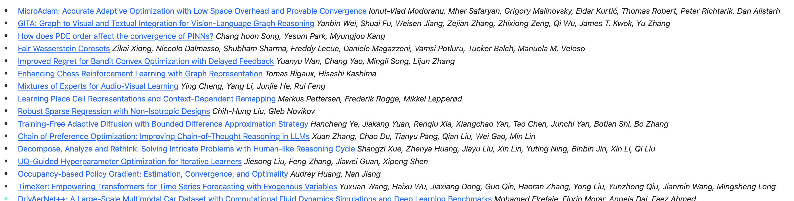

**Due Date: 13 Oct 2025**

For this week, we will try two things:

- Hybrid Search
- Reverse Image Search

## Hybrid Search on NIPS Papers

NIPS is one of the most famous conferences and easily the biggest in the machine learning community. 
If you go to the website, you will find a lot of papers. Lets start with the [2024 version](https://papers.nips.cc/paper_files/paper/2024) only.

As you can see, there are a lot of papers. And each paper has:
- A title
- Link to the paper
- A list of authors

Seeing the hierarachial structure of data for the authors, we can quickly realize that MongoDB is the preferable option there.

Your task is:

- Scrap all the papers data from the page.
- Store them in a MongoDB collection (having title, authors and link).
- Create a search engine that can search for papers based on the title, authors, or keywords

## Reverse Image Search

Reverse image search is a very popular search engine. It is used to find images that are similar to the one you are looking for.

For reverse image search, we will also calculate embeddings for the images, just like we did for the text.
We can use CNNs/Resnets or we can also use Vision Transformers (available on Hugging Face) for the purpose.

> A good ViT model is [ViT-B/32](https://huggingface.co/google/vit-base-patch16-224).

Now your task is:

- Make a folder of 20-30 images (please don't use any personal sort of images) and calculate embeddings for them.
- Take a "query" image and calculate its embedding
- Find the closest image to the query image using the embeddings

This is extremely exciting. You can easily convert it into a mobile app to use it on your phone. 
You are doing image search on your phone without sending your data to Google or 3rd party.