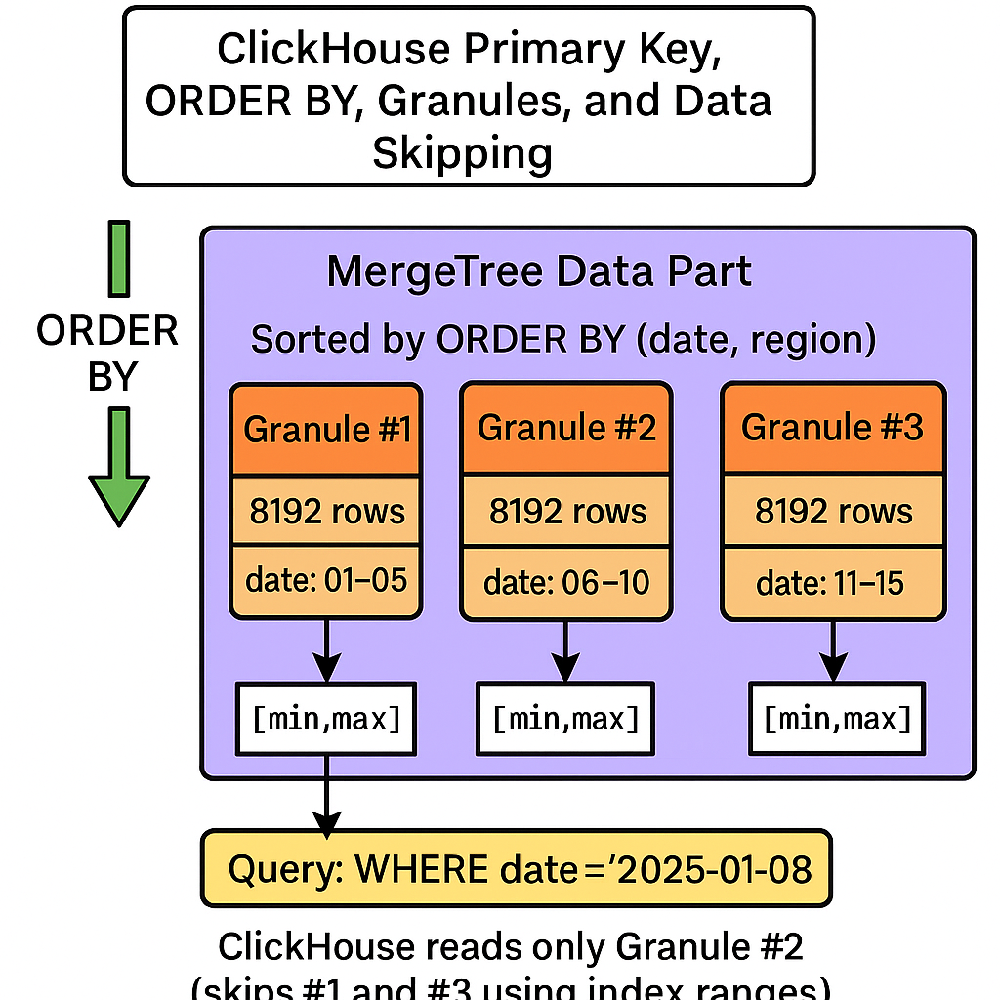
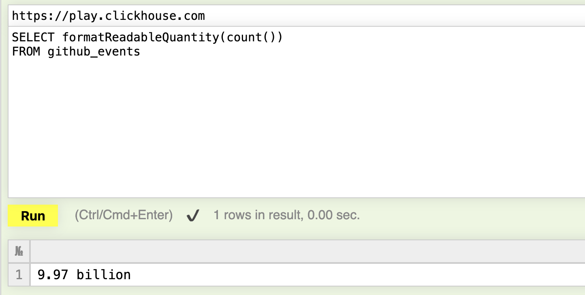
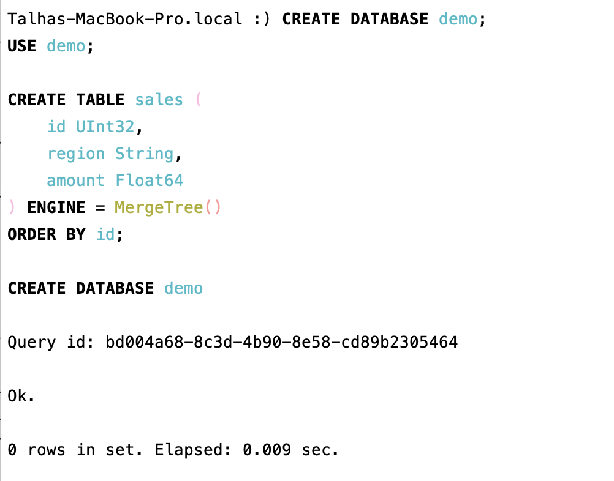

# ClickHouse

---

# **From OLTP to OLAP: Inside ClickHouse and the Future of Analytical Databases**

---

## **I. Introduction – The Data Explosion and the Shift to OLAP**

In default transactional databases, data is useful for some time but then becomes historical or archival. Consider an e-commerce website like Amazon. When you buy something, its database entry is operational or important until it ships (or during the 30-day free returns period), and after that, it exists mainly for historical purposes. This is similar to banking transactions or electric bills, which are primarily kept for archival reasons.

This data can grow rapidly, which means we need to:

- Store it efficiently (using less storage space)
- Query it in real-time

---

## **II. OLTP vs OLAP – Two Different Worlds**

Traditional databases like MySQL and PostgreSQL are not built for large-scale analytical queries. Let’s explore why.

### Limitations of OLTP

Imagine a small business like a restaurant. Daily transactions might not be huge initially, but over time, they can quickly reach terabytes of data. Suppose we want to analyze which dishes were popular over the last couple of years. A basic approach might be to query the ORDERS table or a logging table in a transactional database, something like:

```sql
<Add a query to select top 5 most ordered dishes from 1 Jan 2024 to now>
```

However, this requires scanning all records, which takes significant time. This is not a fault of the database per se; traditional OLTP systems like MySQL and PostgreSQL excel at live transactional operations but are not optimized for querying large historical datasets.

<aside>
💡

Traditional transactional databases use row-based storage, meaning they read entire rows even if only a few columns are needed. This is like reading entire rows in a matrix, which is inefficient for analytical queries.

</aside>

A more efficient approach is to read only the required columns, similar to how Excel allows you to select specific columns.

---

## **III. OLAP and Columnar Storage Foundations**

### Row-based vs Column-based Storage

OLAP (Online Analytical Processing) systems use columnar storage, which stores data column-wise rather than row-wise. This enables reading only the necessary columns for a query, reducing I/O and improving query speed.

### I/O Efficiency and Compression

Columnar storage allows for better compression techniques such as:

- Run-Length Encoding (RLE)
- Dictionary Encoding
- Delta Encoding

These reduce storage size and speed up data retrieval.

### Vectorized CPU Execution

Modern OLAP engines use vectorized processing (SIMD - Single Instruction, Multiple Data) to operate on batches of data in parallel, boosting performance.

### Columnar File Formats

Popular formats like Parquet, ORC, and Arrow facilitate efficient columnar data storage and interoperability.

💡 *Visual idea:* Diagram comparing row and column layouts.

### OLAP Systems and Data Warehousing Concepts

OLAP architectures often use star or snowflake schemas, optimized for aggregation, grouping, and filtering queries. ETL (Extract, Transform, Load) pipelines prepare data for analysis in data warehouses.

Execution optimizations such as predicate pushdown and parallel query execution are common in systems like Snowflake, BigQuery, and Druid.

💡 *Visual idea:* “OLTP → ETL → Warehouse → OLAP Query Engine” pipeline diagram.

---

## **IV. ClickHouse – The Open-Source OLAP Powerhouse**

ClickHouse was developed by Yandex in 2016 with the goal of delivering high-speed analytical queries on large datasets through a simple, append-only design.

### Architecture Overview

- Data is organized into tables consisting of data parts.
- Each data part contains columns stored as separate files (.bin for data and .mrk for marks/indexes).
- The system uses a family of engines, with MergeTree being the core, along with variants like SummingMergeTree and AggregatingMergeTree.

💡 *Visual idea:* Diagram of MergeTree data flow (Insert → Parts → Merge → Query).

---

## **V. MergeTree Internals – A Columnar LSM-Tree**



MergeTree is ClickHouse’s internal storage engine combining columnar storage with Log-Structured Merge-Tree (LSM-Tree) principles.

### Key Features

- **Data parts and granularity:** Data is split into immutable parts for efficient management.
- **Marks & sparse indexing:** Indexes are stored every ~8192 rows to speed up seeking.
- **Column-level compression codecs:** Supports ZSTD, LZ4, Delta, and others for effective compression.
- **Background merges:** Compaction and deduplication happen asynchronously to optimize storage.
- **Immutable storage:** No UPDATE or DELETE operations; data is appended only.
- **ORDER BY as primary index:** Determines data sorting inside parts for efficient query filtering.

💡 *Visual idea:* MergeTree lifecycle diagram.

---

## **VI. Query Execution in ClickHouse**

ClickHouse executes queries through a highly optimized pipeline:

- Reads only the required columns from data parts.
- Decompresses data blocks.
- Applies filters and predicate pushdown.
- Performs aggregation and grouping.
- Outputs results in a streamed, memory-efficient manner.

### Performance Enhancements

- Vectorized processing operates on column blocks using SIMD instructions.
- Queries run in parallel across multiple CPU cores.
- Streamed execution reduces memory footprint and latency.

💡 *Visual idea:* Pipeline diagram with data flow arrows.

---

## **VII. Why ClickHouse Is So Fast**

| **Design Choice**           | **Benefit**                      |
|----------------------------|---------------------------------|
| Columnar layout            | Reads only relevant columns      |
| Compression               | Smaller I/O footprint            |
| Sparse indexes            | Skip irrelevant data blocks      |
| Append-only design        | No write locks                   |
| Vectorized CPU execution  | SIMD-level parallelism           |
| Background merges         | Continuous optimization          |
| Parallel processing       | Fully utilizes hardware          |

💡 *Visual idea:* Benchmark bar chart — PostgreSQL vs ClickHouse.

---

## **VIII. How ClickHouse Differs from Other Databases**

- **ClickHouse vs MySQL/PostgreSQL:** OLAP vs OLTP focus.
- **ClickHouse vs BigQuery/Snowflake:** Open-source, on-premise vs managed cloud services.
- **ClickHouse vs Druid:** MergeTree columnar LSM-tree vs segment-based architecture.

Real-world example: aggregating 1 billion rows in under 1 second.

Try it yourself at [play.clickhouse.com](http://play.clickhouse.com), which runs nearly 10 billion GitHub archival records queries in less than 0.01 seconds.



*There are a couple of [examples](https://play.clickhouse.com/play?user=play#U0VMRUNUCiAgICB5ZWFyLAogICAgY291bnQoKSBBUyBzdGFycwpGUk9NIGdpdGh1Yl9ldmVudHMKV0hFUkUgKGV2ZW50X3R5cGUgPSAnV2F0Y2hFdmVudCcpIApBTkQgKHJlcG9fbmFtZSA9ICdDbGlja0hvdXNlL0NsaWNrSG91c2UnKQpHUk9VUCBCWSB0b1llYXIoY3JlYXRlZF9hdCkgQVMgeWVhcgpPUkRFUiBCWSBzdGFycyBERVNDCg==) demonstrated in their [introduction video](https://www.youtube.com/watch?v=j_kKKX1bguw).*

---

## **IX. Advanced Features and Use Cases**

ClickHouse supports a rich ecosystem including:

- Materialized views for pre-aggregated data.
- Distributed tables and joins for scaling across nodes.
- Window functions for complex analytics.
- Integrations with Kafka, dbt, Airflow, Grafana.
- Common use cases: observability, dashboards, machine learning feature stores.

💡 *Visual idea:* “ClickHouse at Cloudflare” case study graphic.

---

## **X. MergeTree Family and Future Directions**

Beyond the core MergeTree engine, ClickHouse offers specialized variants:

- **SummingMergeTree:** For summation aggregations.
- **AggregatingMergeTree:** For rollup aggregations.
- **ReplacingMergeTree:** Supports deduplication.
- **CollapsingMergeTree:** Tracks versions and handles data corrections.
- **Projections & materialized views:** For query acceleration.
- Cloud ClickHouse with S3 storage integration.

💡 *Visual idea:* MergeTree “family tree” diagram.

---

## **XI. Research Foundations**

ClickHouse builds on decades of database research:

- *The Log-Structured Merge-Tree* (O’Neil et al., 1996)
- *C-Store: A Column-Oriented DBMS* (Stonebraker et al.)
- MonetDB/X100 vectorized execution papers
- Google Dremel (basis for BigQuery)
- Compression encoding research (Delta, RLE, Dictionary)

💡 *Visual idea:* Timeline showing MonetDB → Dremel → ClickHouse evolution.

---

## **XII. Practical Tutorial**

Installing ClickHouse is straightforward. From the terminal:

```bash
curl https://clickhouse.com/ | sh
```

This will take a few minutes. Then install with:

```bash
sudo ./clickhouse install
```

You will be prompted for:

- Password for the default user (for starters, keep it simple like `123`)
- Whether to allow server connections from the network (y/n)

Start the server:

```bash
sudo clickhouse start
```

In another terminal, connect with:

```bash
clickhouse-client
```

Enter your password (`123`), and you can now run queries.



### Using ClickHouse from Python

Install the connector:

```bash
pip install clickhouse-connect
```

Connect and query:

```python
from clickhouse_connect import get_client
client = get_client(host='localhost', username='default', password="123")
print(client.query('SELECT 1').result_rows)
```

If connected successfully, it will output `1`.

---

## **XIII. Conclusion – The New Age of Analytical Databases**

- OLAP complements OLTP rather than replacing it.
- Columnar storage and vectorization revolutionized analytics.
- MergeTree demonstrates that open-source systems can rival cloud OLAP solutions.
- The future lies in hybrid data stacks combining OLTP and OLAP.

💬 *End quote:*

> “Store your data in PostgreSQL.  
> Analyze it in ClickHouse.”

💡 *Visual idea:* Combined OLTP + OLAP “modern data stack” diagram.

---

## **Appendices**

- **A. Glossary:** OLAP, OLTP, MergeTree, SIMD, Predicate Pushdown, Compression.
- **B. References:** Academic papers, official docs, blogs, GitHub links.
- **C. Example SQL snippets for demo.

---